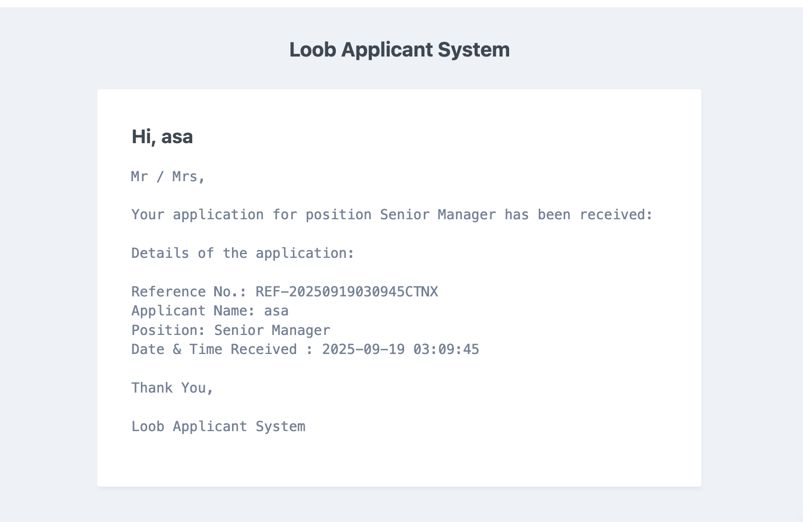
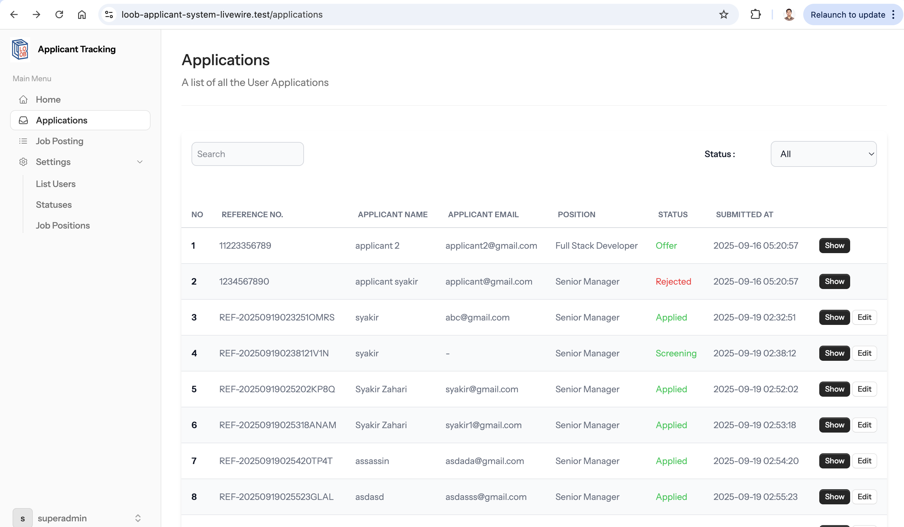
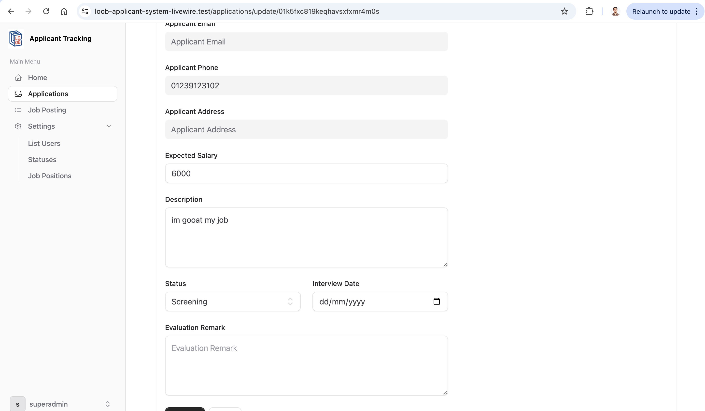
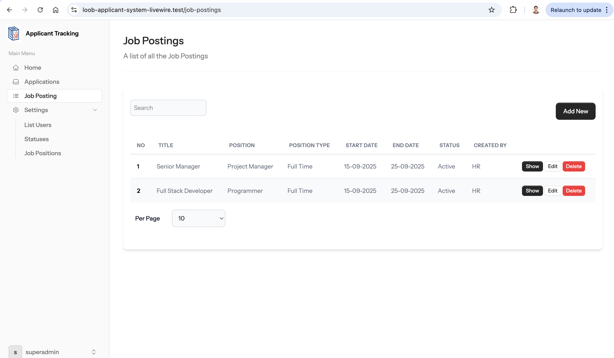
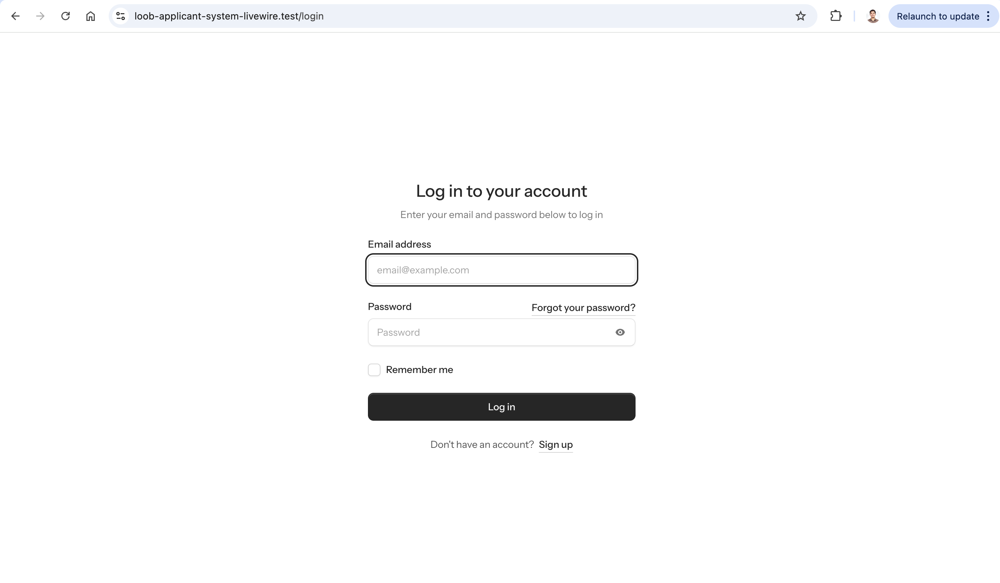
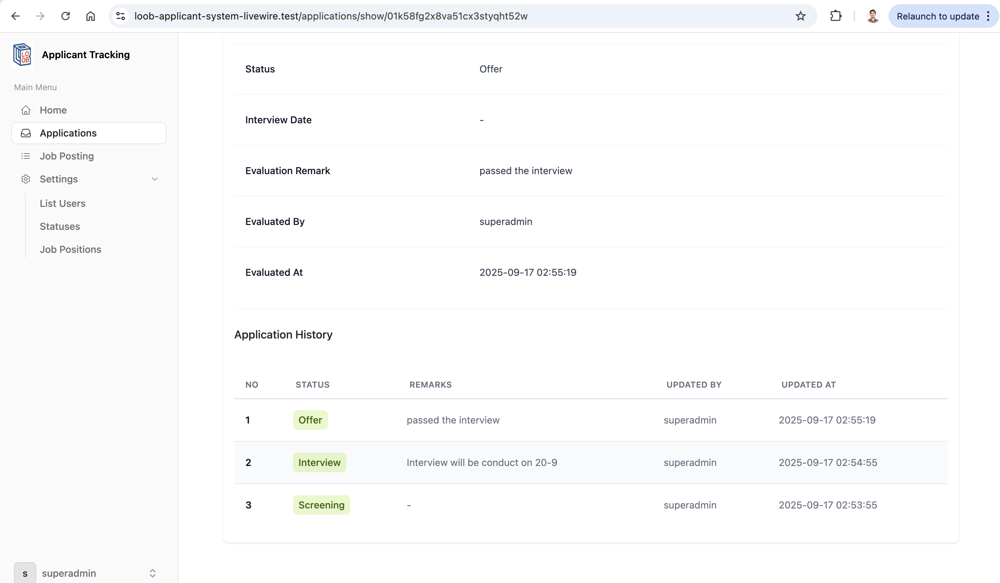

# Loob Job Search Laravel

A system to manage job application at Loob Holding Sdn Bhd.

# Stack

1. PHP 8.3 + Laravel 12
2. Livewire 3.0
3. MySQL 8.0
4. Composer

## Installation

Make sure you already installed [Laravel](https://laravel.com/docs/12.x/installation) and [Composer](https://getcomposer.org/) on your machine.

## Usage

1. Clone project from this repository to folder

```bash
git clone https://github.com/syakirzahari/loob-job-application-laravel
```

2. Install node modules

```bash
npm install
```

3. Install dependencies

```bash
composer install
```

4. Duplicate file .env.example and rename as .env in root folder

5. Change connection to database in .env and create new database

6. Generate project key

```bash
php artisan key:generate
```

7. Run migrations and seeders

```bash
php artisan migrate --seed
```

8. Run the project (or use any web development server installed etc: herd, laragon)

```bash
php artisan serve
```

8. Integration / Unit tests

```bash
php artisan test
```

### Testing account:

email: supeadmin@loob.com

password: password

## Menu

This application consists of 4 main menus,

i. Login

ii. Dashboard

iii. Application

1. Check and track applicant status
2. Update applicant status

iv. Vacancy

1.  List of vacancies available
2.  Add, edit, update, delete vacancies.

v. Data Reference

## Code Structure

```bash
📦app
 ┣ 📂Http
 ┃ ┣ 📂Controllers
 ┃ ┃ ┣ 📂API # API Controller for usage of mobile application
 ┃ ┃ ┃ ┣ 📂Application
 ┃ ┃ ┃ ┃ ┗ 📜ApplicationAPIController.php
 ┃ ┃ ┃ ┗ 📂JobPosting
 ┃ ┃ ┃ ┃ ┗ 📜JobPostingAPIController.php
 ┃ ┃ ┣ 📂Auth
 ┃ ┃ ┃ ┗ 📜VerifyEmailController.php
 ┃ ┃ ┗ 📜Controller.php
 ┃ ┣ 📂Helpers # Helper Functions
 ┃ ┃ ┣ 📜ApiLogHelper.php
 ┃ ┃ ┗ 📜ApplicationLogHelper.php
 ┃ ┣ 📂Middleware # Middleware to protect API
 ┃ ┃ ┗ 📜ProtectApi.php
 ┃ ┣ 📂Requests
 ┃ ┃ ┣ 📜ApplicationRequest.php
 ┃ ┃ ┣ 📜JobPostingRequest.php
 ┃ ┃ ┣ 📜RefJobPositionRequest.php
 ┃ ┃ ┗ 📜RefStatusRequest.php
 ┃ ┗ 📂Resources
 ┃ ┃ ┣ 📜ApplicationResource.php
 ┃ ┃ ┣ 📜JobPostingResource.php
 ┃ ┃ ┣ 📜RefResource.php
 ┃ ┃ ┗ 📜StatusLogResource.php
 ┣ 📂Livewire # Livewire Action
 ┃ ┣ 📂Actions
 ┃ ┃ ┗ 📜Logout.php
 ┃ ┣ 📂Applications
 ┃ ┃ ┣ 📜Create.php
 ┃ ┃ ┣ 📜Edit.php
 ┃ ┃ ┣ 📜Index.php
 ┃ ┃ ┗ 📜Show.php
 ┃ ┣ 📂Auth
 ┃ ┃ ┣ 📜ConfirmPassword.php
 ┃ ┃ ┣ 📜ForgotPassword.php
 ┃ ┃ ┣ 📜Login.php
 ┃ ┃ ┣ 📜Register.php
 ┃ ┃ ┣ 📜ResetPassword.php
 ┃ ┃ ┗ 📜VerifyEmail.php
 ┃ ┣ 📂Forms
 ┃ ┃ ┣ 📜ApplicationForm.php
 ┃ ┃ ┣ 📜JobPostingForm.php
 ┃ ┃ ┣ 📜RefJobPositionForm.php
 ┃ ┃ ┣ 📜RefStatusForm.php
 ┃ ┃ ┗ 📜UserForm.php
 ┃ ┣ 📂JobPostings
 ┃ ┃ ┣ 📜Create.php
 ┃ ┃ ┣ 📜Edit.php
 ┃ ┃ ┣ 📜Index.php
 ┃ ┃ ┗ 📜Show.php
 ┃ ┣ 📂RefJobPositions
 ┃ ┃ ┣ 📜Create.php
 ┃ ┃ ┣ 📜Edit.php
 ┃ ┃ ┣ 📜Index.php
 ┃ ┃ ┗ 📜Show.php
 ┃ ┣ 📂RefStatuses
 ┃ ┃ ┣ 📜Create.php
 ┃ ┃ ┣ 📜Edit.php
 ┃ ┃ ┣ 📜Index.php
 ┃ ┃ ┗ 📜Show.php
 ┃ ┣ 📂Settings
 ┃ ┃ ┣ 📜Appearance.php
 ┃ ┃ ┣ 📜DeleteUserForm.php
 ┃ ┃ ┣ 📜Password.php
 ┃ ┃ ┗ 📜Profile.php
 ┃ ┗ 📂Users
 ┃ ┃ ┣ 📜Create.php
 ┃ ┃ ┣ 📜Edit.php
 ┃ ┃ ┣ 📜Index.php
 ┃ ┃ ┗ 📜Show.php
 ┣ 📂Models # Models
 ┃ ┣ 📂Application
 ┃ ┃ ┣ 📜Application.php
 ┃ ┃ ┗ 📜Log.php
 ┃ ┣ 📂Job
 ┃ ┃ ┗ 📜JobPosting.php
 ┃ ┣ 📂Ref
 ┃ ┃ ┣ 📜ApiLogType.php
 ┃ ┃ ┣ 📜Position.php
 ┃ ┃ ┗ 📜Status.php
 ┃ ┣ 📜ApiLog.php
 ┃ ┗ 📜User.php
 ┣ 📂Notifications # Email Notification
 ┃ ┣ 📜ApplicationReceived.php
 ┃ ┣ 📜ApplicationRejected.php
 ┃ ┣ 📜InterviewOffer.php
 ┃ ┗ 📜JobOffer.php
 ┗ 📂Providers
 ┃ ┗ 📜AppServiceProvider.php
📦database  # Handle database migration and data seeders
 ┣ 📂factories
 ┣ 📂migrations
 ┣ 📂seeders
 ┣ 📜.gitignore
 ┗ 📜database.sqlite
📦resources
 ┣ 📂css
 ┃ ┗ 📜app.css
 ┣ 📂js
 ┃ ┗ 📜app.js
 ┗ 📂views
 ┃ ┣ 📂components
 ┃ ┣ 📂flux
 ┃ ┣ 📂livewire  # livewire blade
 ┃ ┃ ┣ 📂application
 ┃ ┃ ┣ 📂auth
 ┃ ┃ ┣ 📂job-posting
 ┃ ┃ ┣ 📂ref-job-position
 ┃ ┃ ┣ 📂ref-status
 ┃ ┃ ┣ 📂settings
 ┃ ┃ ┗ 📂user
 ┃ ┣ 📂mail
 ┃ ┣ 📂partials
 ┃ ┣ 📜dashboard.blade.php
 ┃ ┗ 📜welcome.blade.php
📦routes
 ┣ 📜api.php  # API route
 ┣ 📜auth.php
 ┣ 📜console.php
 ┗ 📜web.php  # Web route
```

## Future Thinking

1. AI-Driven to automate and filter application process.
2. Keeps a talent pool of past applicants.

AI automatically suggests re-engaging old candidates when new matching roles open

3. Integrated chatbot assistant to answer candidate questions 24/7.
4.

## Screenshot

<p align="center">
  
  
  

  
  
</p>

## Contributing

Pull requests are welcome. For major changes, please open an issue first
to discuss what you would like to change.

Please make sure to update tests as appropriate.

```

```
